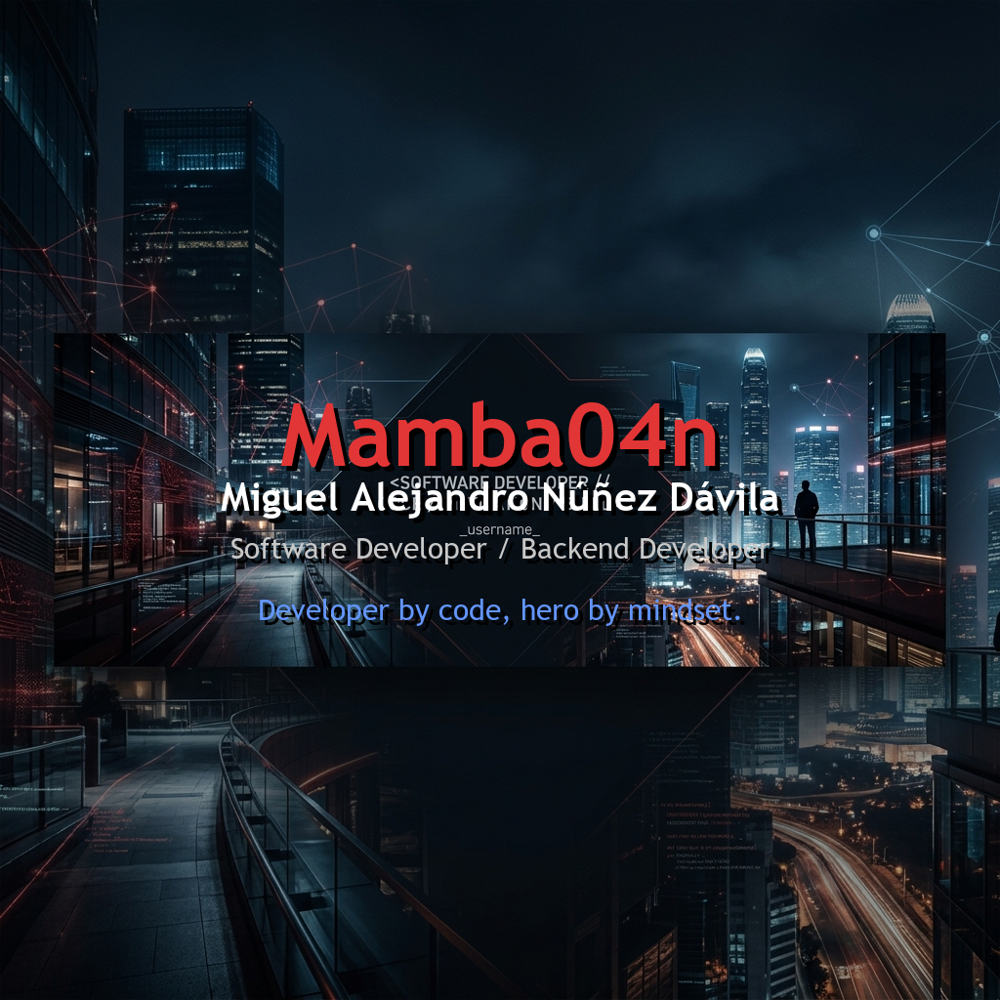

  

  

 

  

 

<table align="center" style="border-collapse: collapse; border: none;">
  <tr style="border: none;">
    <td width="65%" style="border: none; vertical-align: top;">
      <h3>🕷️ Identidad & Enfoque</h3>
      Soy estudiante de <b>Ingeniería de Sistemas (UNI)</b> y un desarrollador enfocado en la construcción de soluciones empresariales, arquitecturas backend y bases de datos relacionales.  
      Mi filosofía de desarrollo se basa en la agilidad, la precisión y la mejora continua. Al igual que un héroe urbano conoce cada rincón de su ciudad, me especializo en conocer a fondo el ecosistema <b>PHP y Laravel</b>, asegurando que cada sistema sea seguro, modular y altamente eficiente.
        
      <ul>
        <li>🏙️ <b>Patrullando los servidores:</b> Desarrollando <b>Nando Grills</b> y escalando <b>Quantum Soluciones</b>.</li>
        <li>⚡ <b>Sentido Arácnido activo:</b> Cacería de bugs y resolución de problemas técnicos complejos.</li>
        <li>🎓 <b>Entrenamiento continuo:</b> CS50x por la Universidad de Harvard.</li>
      </ul>
    </td>
    <td width="35%" align="center" style="border: none; vertical-align: middle;">
      
    </td>
  </tr>
</table>

  

 

### 🕸️ Arsenal Tecnológico

  

 

  

 

### 📊 Radar de Actividad (GitHub Stats)

  
  

 

  

 

### 🦸‍♂️ Conecta Conmigo

Ya sea para hablar de código, arquitecturas MVC o tu próxima gran idea, mi comunicador siempre está encendido:

  
  

   
  

